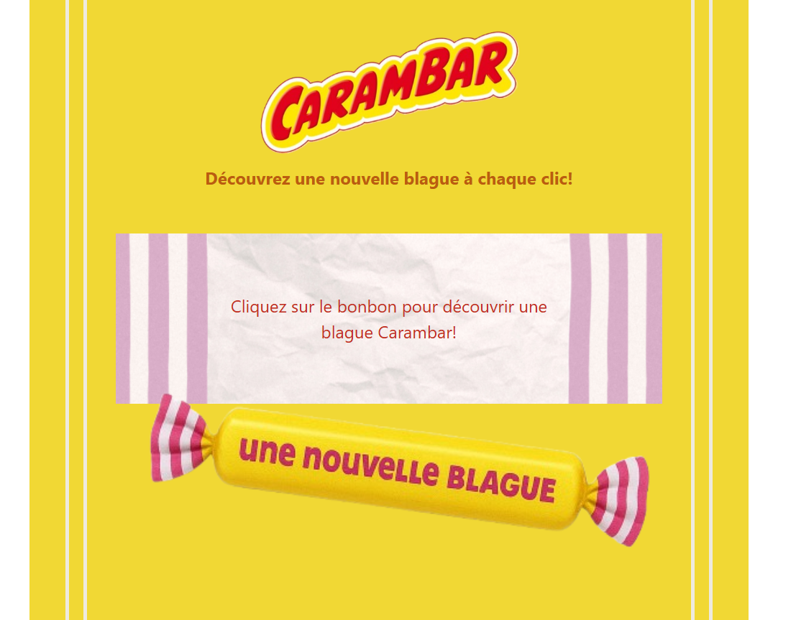

# API de blagues Carambar - Frontend

## Présentation du projet
Ce repository présente une interface utilisateur intuitive permettant de découvrir des blagues de façon aléatoire. Ce frontend consomme l'API de blagues développée en parallèle et constitue la partie visible de mon projet de démonstration pour ma candidature à l'école d'informatique Simplon.

## Technologies utilisées 
- **Framework:** Vue.js
- **Langage:** TypeScript
- **Requêtes API:** Axios
- **Style:** SCSS
- **Build:** Vue CLI

## Fonctionnalités
- Affichage de blagues avec mise en forme adaptée
- Bouton pour obtenir une blague aléatoire
- Interface responsive et intuitive
- Intégration avec l'API backend

## Configuration
Dans le fichier .env et .env.production, la variable VUE_APP_API_BASE_URL permet de définir l'URL de base du serveur API.

## Installation et démarrage
`bash`
### Cloner le repository
`git clone https://github.com/CHSPN/carambar-frontend.git`
`cd carambar-frontend`

### Installer les dépendances
`npm install`

### Démarrer le serveur de développement
`npm run dev`

### Construire pour la production
`npm run build`

## Composant
- **JokeComponent:** Affiche une blague comprenant une question et une réponse

## Structure du projet côté frontend
carambar-front/  
├── public/  
│   ├── index.html  
│   └── favicon.ico  
├── src/  
│   ├── assets/  
│   │   └── styles/  
│   │       └── main.scss  
│   ├── components/  
│   │   └── JokeComponent.vue  
│   ├── services/  
│   │   └── api.ts  
│   ├── views/  
│   │   └── HomeView.vue  
│   ├── App.vue  
│   └── main.ts  
├── .gitignore  
├── package.json  
├── tsconfig.json  
├── vue.config.js  
└── README.md  

## Responsive Design
L'interface s'adapte à différentes tailles d'écran:
- **Mobile:** < 768px
- **Tablette:** 768px - 1024px
- **Desktop:** > 1024px

## Choix d'interface
- **Design épuré:** Focus sur le contenu des blagues
- **Colorimétrie adaptée au contenu:** Couleurs cohérentes avec la marque et le contenu
- **Animations subtiles:** Pour améliorer l'expérience utilisateur

## Liens
- **Application de blagues Carambar:** https://chspn.github.io/carambar-front/
- **Repository GitHub de la partie Backend:** https://github.com/CHSPN/carambar-api
- **Repository Github de la partie Frontend:** https://github.com/CHSPN/carambar-front
- **Documentation API:** https://carambar-api-h0la.onrender.com/

## Auteur
Charlène SCOMPARIN